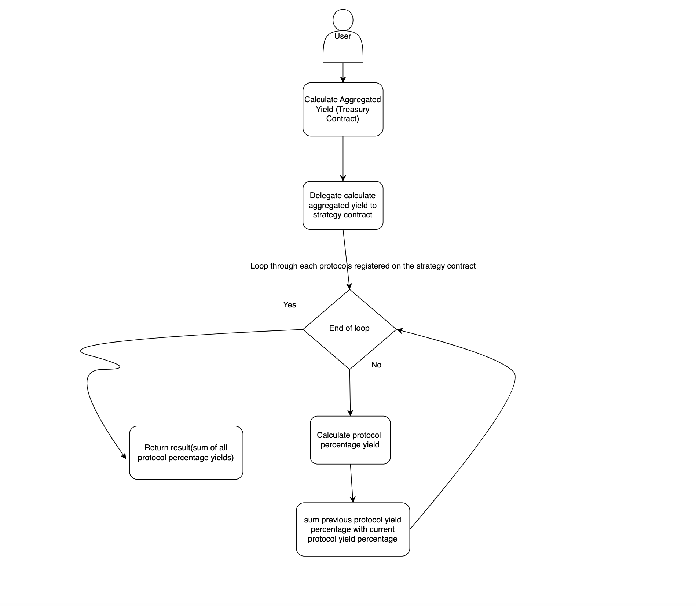
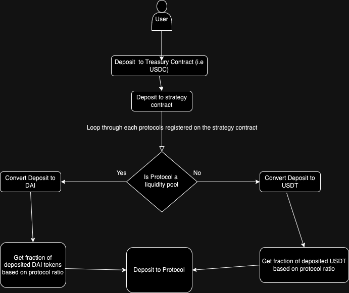
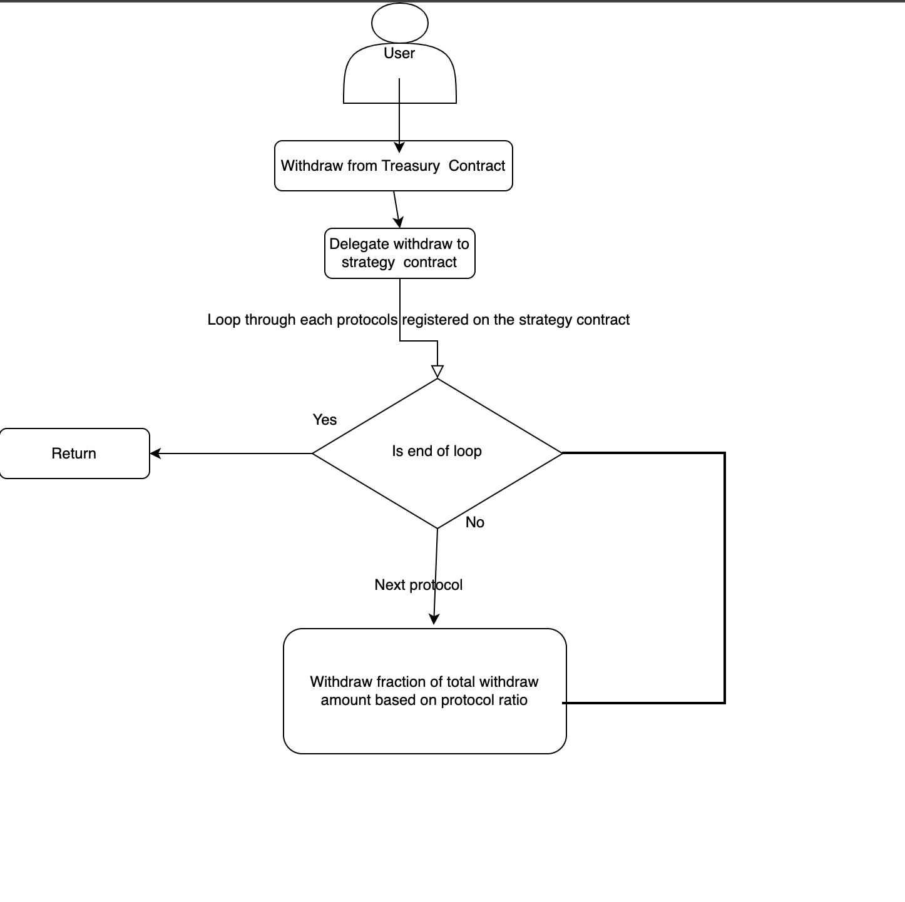

# Treasury, Strategy, and Protocol Interaction

This document provides an overview of the interactions between the Treasury, Strategy, and Protocol contracts in the decentralized finance (DeFi) system.

## Overview

The system consists of three main contracts:

- **Treasury**: Manages the overall funds, interacts with depositors, and orchestrates the distribution of funds across different protocols.
  
- **Strategy**: Implements investment strategies and manages interactions with various protocols to maximize yield.

- **Protocol**: Represents different decentralized finance protocols where funds are invested to earn yield.

## Flow of Interactions

### 1. Treasury Contract

- **Responsibility**: Manages overall funds and interacts with depositors.
  
- **Deposits**: Accepts deposits from users in the form of various tokens, including stablecoins and native tokens.
  
- **Strategy Integration**: Utilizes the `Strategy` contract to implement investment strategies and maximize yield.

- **Withdrawals**: Allows depositors to withdraw their funds along with accumulated yield.

- **Treasury Token Issuance (TODOS)**: Issues treasury-specific tokens (e.g., DaiTreasuryToken, UsdtTreasuryToken) to depositors in return for their deposits.

### 2. Strategy Contract

- **Responsibility**: Implements investment strategies and manages interactions with multiple protocols.

- **Dynamic Strategy Allocation**: Allocates deposited funds dynamically across different protocols based on predefined ratios.

- **Deposit to Protocols**: Interacts with different protocols to deposit funds and earn yield.

- **Withdraw from Protocols**: Manages the withdrawal of funds and yield from various protocols.

- **Aggregated Yield Calculation**: Calculates the aggregated yield across all integrated protocols.

### 3. Protocol Contract

- **Responsibility**: Represents individual decentralized finance protocols.

- **Deposit and Withdrawal**: Handles the deposit and withdrawal of funds from the specific protocol.

- **Yield Generation**: Implements mechanisms to generate yield based on the deposited funds.

## Contracts Interaction Diagram

For more detailed information on each contract and their functions, refer to the respective contract files.

## Dependencies

- Solidity 0.8.19
- OpenZeppelin Contracts (ERC20, Ownable, ReentrancyGuard)
- UniswapV2Router
- Ethers.js
